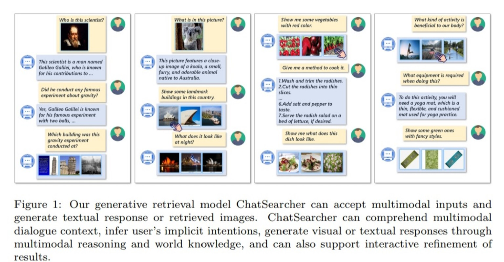
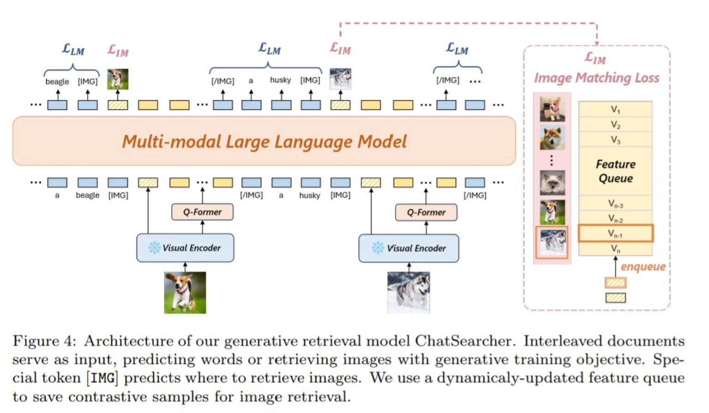
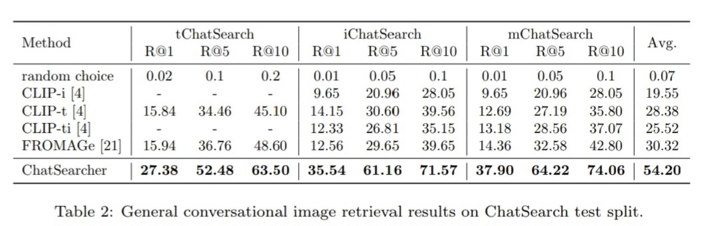

# Asala Abo Grara - ChatSearch Proposal-Focused Summary

## Paper Information

| Item | Details |
|---|---|
| Paper | ChatSearch: A Dataset and a Generative Retrieval Model for General Conversational Image Retrieval |
| Main Topic | Conversational Image Retrieval (CIR) |
| Modalities | Text + Image |
| Main Use for Our Proposal | Inspiration for multimodal conversational context and user-intent reasoning. |

---

## 1. Why This Paper Matters for the Proposal

This paper is useful because it shows how a system can use **multi-turn dialogue** and **multimodal input** to understand what the user is looking for. Instead of treating each query separately, the model uses the full conversation context to infer implicit intent.

For our proposal, this supports the broader idea that a multimodal system should not depend on one isolated signal. It should use context and multiple inputs together to make a better decision.

---

## 2. Main Idea

The paper introduces:

- **ChatSearch dataset** for conversational image retrieval.
- **ChatSearcher model** for generating responses and retrieving images from interleaved text-image conversations.
- A framework that combines language understanding, visual representation, and retrieval.

---

## 3. Important Points for the Proposal

- User intent can be distributed across several dialogue turns.
- Multimodal inputs can improve retrieval compared with single-query systems.
- Image-text interaction is more powerful when the model understands conversation history.
- The architecture can inspire future multimodal conversational systems that use audio and facial expressions.

---

## 4. Selected Important Figures and Tables

### Figure 1: General Conversational Image Retrieval

**Why it is important:** This figure clearly explains the general task of conversational image retrieval and shows how multimodal dialogue can guide retrieval.

### Figure 4: ChatSearcher Architecture

**Why it is important:** This figure is useful for understanding how different components work together: visual encoder, Q-Former, language model, and retrieval module.

### Table 2: Main Retrieval Results

**Why it is important:** This table shows that a multimodal conversational model can perform better than traditional retrieval baselines.

---

## 5. Research Gap

ChatSearch focuses mainly on **text-image conversational retrieval**. It does not handle audio, facial expressions, noisy real-world signals, missing modalities, or dynamic modality reliability.

**Gap we can use:**

> Existing conversational retrieval systems still need to be extended toward richer multimodal inputs such as audio and facial expressions, especially when some modalities are noisy, missing, or unreliable.

---

## 6. How This Paper Helps Our Final Proposal

This paper can be used in the proposal as a reference for the **conversational and retrieval direction**. Our project can start with audio and facial-expression fusion, then connect this idea to multimodal conversational interaction.

Possible use in our proposal:

- Keep user/context history instead of one-shot decisions.
- Extend multimodal reasoning from text-image to audio-face inputs.
- Use multimodal context to improve emotion, state, or retrieval decisions.

---

## 7. Final Takeaway

ChatSearch is not directly about audio-visual emotion recognition, but it is important because it supports the idea of **context-aware multimodal interaction**. Our project can build on this idea by adding audio and facial-expression modalities.
