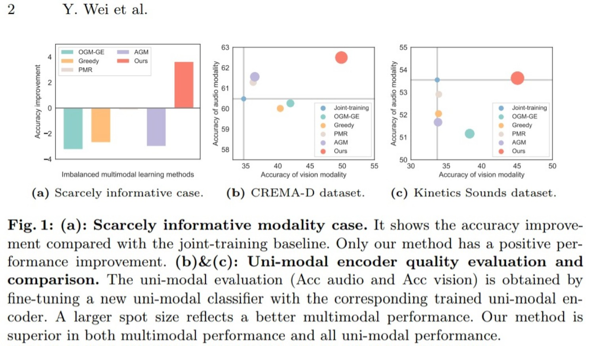
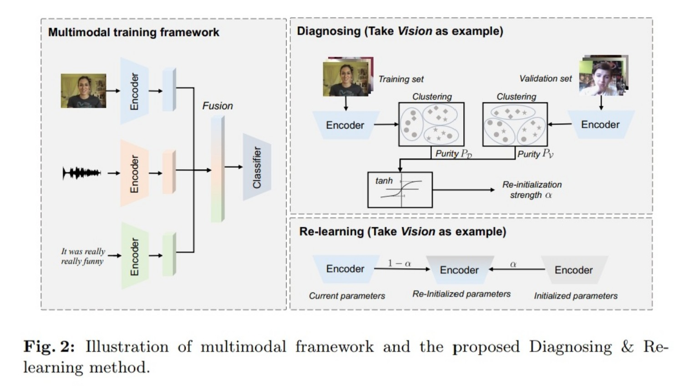
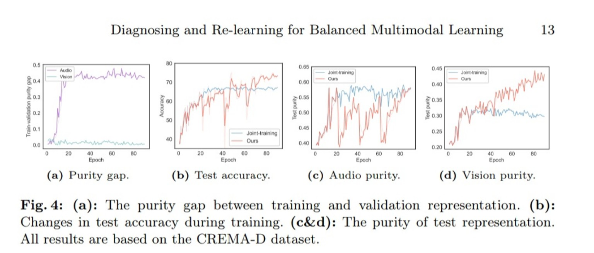

# Asala Abo Grara - Diagnosing and Re-learning for Balanced Multimodal Learning

## Paper Information

| Item | Details |
|---|---|
| Paper | Diagnosing and Re-learning for Balanced Multimodal Learning |
| Main Topic | Balanced Multimodal Learning |
| Main Problem | Modality imbalance and under-learning of some modalities |
| Main Method | Diagnosing learning state + soft re-initialization |
| Relevance to Our Project | Helps diagnose whether audio or visual features dominate in the prototype. |

---

## 1. Paper Overview

This paper studies the problem of **imbalanced multimodal learning**, where a multimodal model prefers certain modalities and underuses others. Existing methods usually identify the weaker modality and try to strengthen it. However, the paper argues that this is not always correct because some modalities may be naturally less informative or noisy.

To address this, the authors propose **Diagnosing & Re-learning**, a method that estimates the learning state of each modality and softly re-initializes modality encoders during training.

---

## 2. Problem Addressed by the Paper

In multimodal learning, different modalities may not be learned equally. For example, in an audio-visual model, the model may rely more on audio and ignore visual information, or the opposite may happen.

Previous balancing methods often assume that the worse-performing modality needs more training. However, this can be harmful when the modality is weak because it contains noise or limited task-related information. In that case, forcing the model to learn more from it may cause noise memorization.

---

## 3. Proposed Solution

The proposed method has two main stages:

### 3.1 Diagnosing

The model diagnoses the learning state of each modality by measuring the separability of its unimodal representation space. It uses clustering purity on the training set and validation set.

A large gap between training purity and validation purity may indicate that the modality is well-learned or over-trained. A smaller gap may indicate under-fitting or limited information.

### 3.2 Re-learning

After diagnosis, the model softly re-initializes each modality encoder based on its learning state. This means the encoder is partially moved back toward its initial parameters instead of being reset completely.

This helps:

- Reduce over-dependence on dominant modalities.
- Encourage under-learned modalities to improve.
- Avoid forcing noisy modalities to memorize irrelevant noise.
- Preserve previously learned useful knowledge.

---

## 4. Important Figures and Tables

### Figure 1: Scarcely Informative Modality Case

This figure shows that existing imbalance methods may fail when one modality is noisy or scarcely informative, while the proposed method still improves performance.

### Figure 2: Diagnosing & Re-learning Framework

This is the main framework. It includes the multimodal training framework, diagnosing through clustering purity, and re-learning through soft encoder re-initialization.

### Figure 3: t-SNE Representation Visualization

This figure visualizes unimodal representations and shows how the proposed method improves representation separability.

### Figure 4: Purity Gap Analysis

This figure tracks purity gap, test accuracy, and test purity during training.

### Tables 1 and 2: Main Comparisons

These tables show that the proposed method outperforms several imbalanced multimodal learning methods on CREMA-D, Kinetics Sounds, and UCF-101.

### Table 4: Scarcely Informative Modality Case

This table is important because it proves that the proposed method remains effective when one modality contains additional noise.

---

## 5. Key Findings

- Modality imbalance is not only about weak modalities needing more training.
- Some modalities may be naturally noisy or less informative.
- A modality learning state can be diagnosed through representation separability.
- Soft re-initialization can help balance learning without completely destroying learned knowledge.
- The method works across different datasets and multimodal frameworks.

---

## 6. Research Gap

The method is mainly evaluated on classification tasks. It does not directly address real-time systems, missing modalities, or dynamic modality quality changes during inference.

**Gap Statement:**

> Diagnosing & Re-learning improves balanced multimodal learning by estimating the learning state of each modality, but its application is mainly training-focused and classification-based. Real-world audio-visual prototypes still require dynamic quality assessment and adaptation when audio or facial signals become noisy, missing, or unreliable.

---

## 7. Contribution to Our Final Project

This paper is useful for our prototype because our system will combine audio and facial expressions. In practice, one modality may dominate the other.

| Paper Idea | Use in Our Project |
|---|---|
| Diagnose each modality separately | Check whether audio or face features are stronger. |
| Avoid over-learning noisy modalities | Reduce reliance on noisy audio or unclear face input. |
| Re-learning strategy | Inspire adaptive retraining or reliability correction. |
| Purity gap | Can inspire a modality quality score. |

---

## 8. Proposed Project Solution Inspired by This Paper

A practical solution for our final prototype is to add a **modality quality diagnosis module** before fusion:

1. Extract audio features and facial features.
2. Estimate quality or confidence for each modality.
3. Detect if one modality is noisy, weak, or unreliable.
4. Adjust fusion weights accordingly.
5. Avoid forcing the system to trust a low-quality modality.

This creates a stronger and more realistic audio-visual prototype.

---

## 9. Final Takeaway

This paper shows that balanced multimodal learning must be careful. A model should not blindly force weak modalities to learn more, especially when they are noisy. For our project, it supports the idea of diagnosing modality quality before fusion.