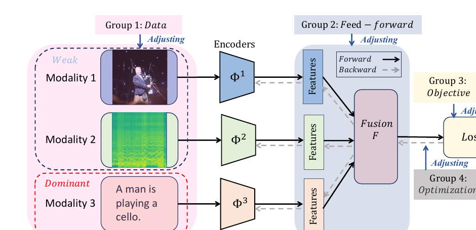
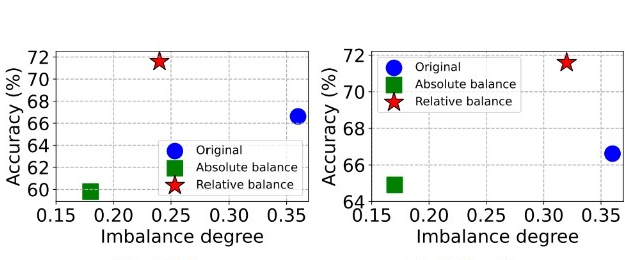
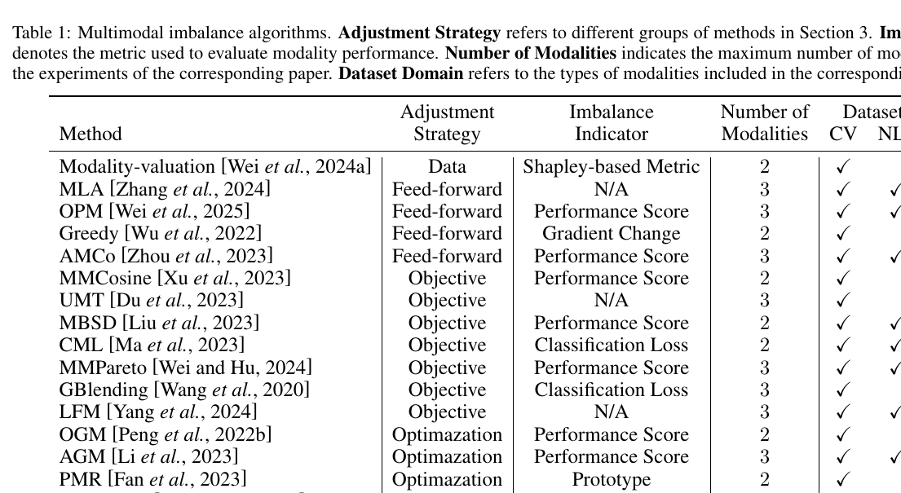

# Asala Abo Grara - BalanceBenchmark: A Survey for Multimodal Imbalance Learning

## Paper Information

| Item | Details |
|---|---|
| Paper | BalanceBenchmark: A Survey for Multimodal Imbalance Learning |
| Main Topic | Survey and Benchmark for Multimodal Imbalance |
| Main Contribution | Taxonomy, benchmark, and toolkit for fair comparison |
| Main Tool | BalanceMM |
| Relevance to Our Project | Provides the main taxonomy for modality imbalance methods and evaluation criteria. |

---

## 1. Paper Overview

This paper is a survey and benchmark for **multimodal imbalance learning**. It reviews existing methods, categorizes them into groups, and evaluates them under a unified benchmark called **BalanceBenchmark**. The authors also introduce **BalanceMM**, a modular toolkit designed to standardize experiments and make comparisons fairer.

The paper is important because it does not focus only on accuracy. It also considers imbalance degree and computational complexity.

---

## 2. Problem Addressed by the Paper

Many studies propose methods to reduce modality imbalance, but comparisons between them are often unfair because they use different datasets, metrics, architectures, and training settings.

The paper identifies three major problems:

1. Lack of diverse and representative datasets.
2. Lack of evaluation metrics beyond accuracy.
3. Lack of standardized experimental workflows.

---

## 3. Proposed Solution

The paper proposes:

### 3.1 Taxonomy of Imbalance Methods

The methods are categorized into four groups:

| Category | Main Idea |
|---|---|
| Data | Adjust or resample the training data. |
| Feed-forward | Modify feature processing or fusion during forward propagation. |
| Objective | Adjust loss functions or learning objectives. |
| Optimization | Modify gradients or optimization dynamics. |

### 3.2 BalanceBenchmark

A benchmark with multiple datasets and metrics to evaluate imbalance methods fairly.

### 3.3 BalanceMM Toolkit

A modular toolkit that supports datasets, backbones, algorithms, and evaluation metrics in a standardized workflow.

---

## 4. Important Figures and Tables

### Figure 1: General Framework and Taxonomy

This figure presents the general multimodal imbalance learning framework and shows the four groups of methods: data, feed-forward, objective, and optimization.

### Figure 2: Performance Gap

This figure shows the gap between the performance of unimodal models and the unimodal branches inside a multimodal model.

### Figure 3: Relative vs. Absolute Balance

This figure is very important because it shows that absolute balance does not always lead to the best performance. Relative balance may be better.

### Table 1: Imbalance Methods Taxonomy

This table summarizes 17 multimodal imbalance algorithms, their strategies, indicators, number of modalities, and dataset domains.

### Table 2: Full Method Comparison

This table compares many methods across multiple datasets.

### Table 3: Computational Cost Comparison

This table compares the average FLOPs of different method categories.

---

## 5. Key Findings

- No existing method achieves the best trade-off between performance, balance, and computational cost.
- Greater balance between modalities does not always guarantee higher performance.
- Relative balance is more useful than absolute balance.
- Objective-based methods often perform well but may not be optimal on all datasets.
- Optimization-based methods can be effective but may require higher computational cost.
- Forward-based methods can be computationally cheaper but may be less general.

---

## 6. Research Gap

Although the paper provides a strong benchmark, it does not provide a final universal solution for multimodal imbalance. It also shows that existing methods still struggle to balance performance, modality balance, and cost.

**Gap Statement:**

> BalanceBenchmark shows that existing multimodal imbalance methods still fail to achieve a satisfactory trade-off between model performance, modality balance, and computational complexity. In practical audio-visual prototypes, a method must be accurate, adaptive, and computationally efficient at the same time.

---

## 7. Contribution to Our Final Project

This paper provides a theoretical and organizational foundation for our project.

| BalanceBenchmark Idea | Use in Our Project |
|---|---|
| Four categories of imbalance methods | Organize related work and justify our method direction. |
| Relative balance | Avoid forcing audio and face to contribute equally. |
| Performance + imbalance + complexity metrics | Evaluate the prototype from multiple perspectives. |
| Toolkit mindset | Design a modular pipeline for audio and face processing. |

---

## 8. Proposed Project Solution Inspired by This Paper

For the final project, we can propose a framework that evaluates:

1. Prediction performance.
2. Audio-face balance degree.
3. Computational cost.
4. Robustness when one modality is weak.

Instead of designing a system that forces equal contribution from audio and face, the prototype should aim for **relative balance**, where each modality contributes according to its reliability and information value.

---

## 9. Final Takeaway

BalanceBenchmark is important because it gives our project a clear taxonomy and shows that modality balance is not enough by itself. A practical multimodal system should balance accuracy, robustness, and computational cost.