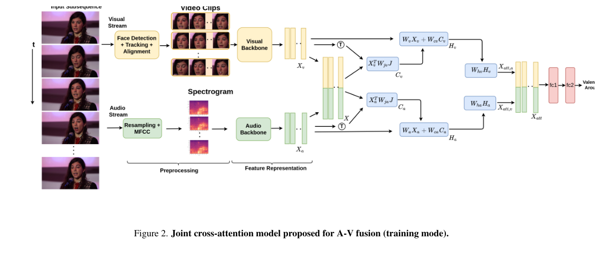
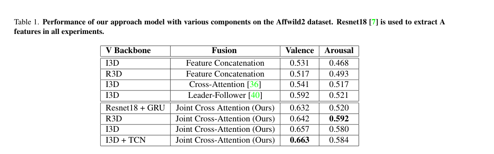
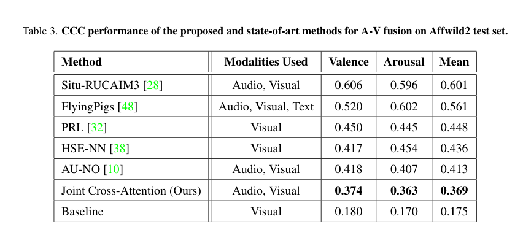

# Asala Abo Grara - Joint Cross-Attention Audio-Visual Fusion Proposal-Focused Summary

## Paper Information

| Item | Details |
|---|---|
| Paper | A Joint Cross-Attention Model for Audio-Visual Fusion in Dimensional Emotion Recognition |
| Main Topic | Audio-visual emotion recognition |
| Modalities | Audio + Visual/Face |
| Main Use for Our Proposal | Direct reference for the core audio-face fusion method. |

---

## 1. Why This Paper Matters for the Proposal

This is one of the most directly related papers to our project because it uses **audio** and **visual facial information** for emotion recognition. It also proposes a cross-attention fusion method instead of simple concatenation.

For our proposal, this paper can be used as the main reference for the audio-visual fusion part.

---

## 2. Main Idea

The paper proposes a **joint cross-attention model** for audio-visual fusion. Instead of only combining audio and visual features at the end, the model allows the modalities to interact through attention.

The method uses:

- Audio feature extraction.
- Visual/facial feature extraction.
- Joint audio-visual representation.
- Cross-attention to learn relationships between modalities.
- Emotion prediction using valence and arousal.

---

## 3. Important Points for the Proposal

- Simple concatenation may not capture the relationship between what is heard and what is seen.
- Cross-attention is useful because it allows one modality to guide the interpretation of another modality.
- Audio and facial features can provide complementary information for emotion/state recognition.
- This architecture can be extended with modality reliability checks.

---

## 4. Selected Important Figure and Tables

### Figure 2: Joint Cross-Attention Architecture

**Why it is important:** This is the main architecture figure. It can be used as the technical base for our proposed audio-face fusion module.

### Table 1: Ablation Study

**Why it is important:** This table shows the effect of different model components and supports the value of cross-attention.

### Table 3: Test Comparison

**Why it is important:** This table supports the effectiveness of the proposed audio-visual fusion method compared with other approaches.

---

## 5. Research Gap

The paper assumes that both audio and visual modalities are available and useful. It does not fully handle missing modalities, noisy audio, unclear faces, or dynamic reliability changes.

**Gap we can use:**

> Existing audio-visual cross-attention models improve fusion, but they still need reliability-aware mechanisms to handle noisy, missing, or imbalanced modalities in real-world conditions.

---

## 6. How This Paper Helps Our Final Proposal

This paper gives us the main fusion direction:

- Use audio and face as the primary modalities.
- Use attention instead of simple concatenation.
- Add a new module before or during attention to estimate modality reliability.
- Dynamically adjust the contribution of audio and visual features.

---

## 7. Final Takeaway

This paper is the strongest technical reference for our prototype. Our contribution can be to improve this type of audio-visual fusion by adding reliability assessment and dynamic modality prioritization.
