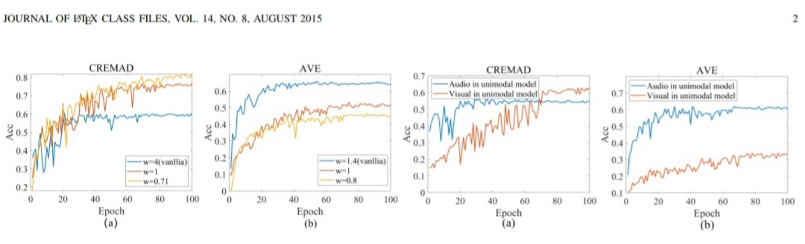
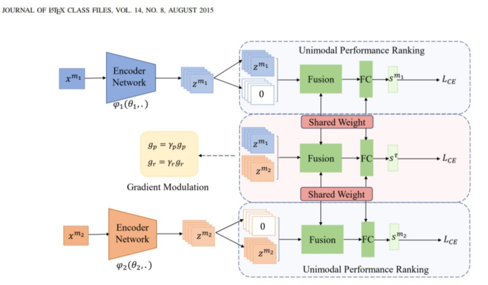
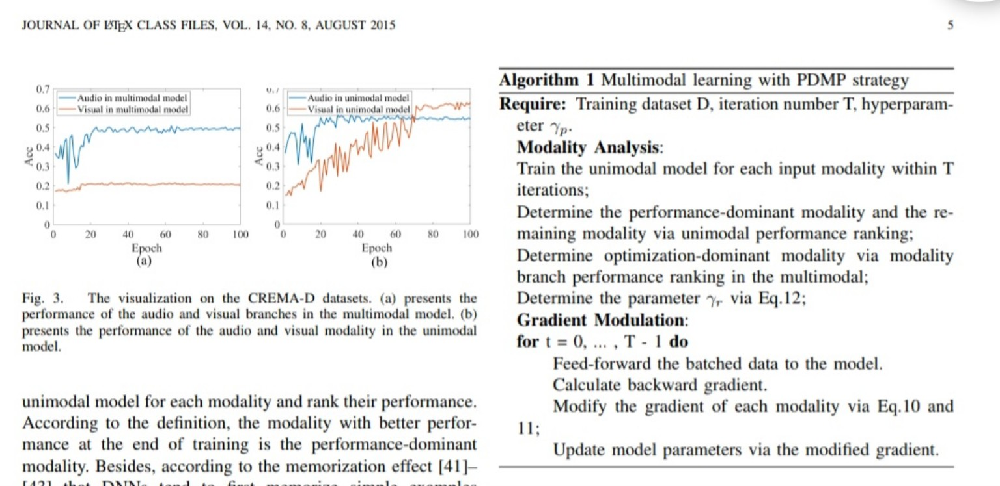
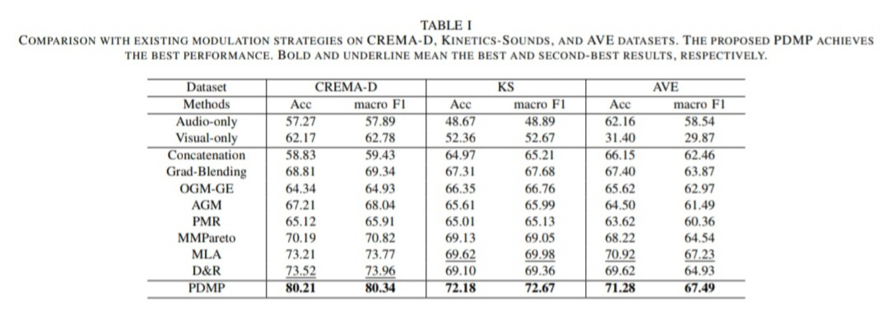

# Asala Abo Grara - PDMP: Rethinking Balanced Multimodal Learning via Performance-Dominant Modality Prioritization

## Paper Information

| Item | Details |
|---|---|
| Paper | PDMP: Rethinking Balanced Multimodal Learning via Performance-Dominant Modality Prioritization |
| Main Topic | Multimodal optimization and modality prioritization |
| Main Problem | Under-optimization and incorrect assumptions about balanced learning |
| Main Method | Performance-Dominant Modality Prioritization (PDMP) |
| Relevance to Our Project | Helps decide whether audio or facial features should be prioritized instead of forcing equal balance. |

---

## 1. Paper Overview

This paper challenges a common assumption in multimodal learning: that balanced learning between modalities always leads to better performance. The authors argue that balanced learning is not always optimal. Instead, a multimodal model may perform better when the **performance-dominant modality** is prioritized during training.

The paper proposes **PDMP**, a strategy that identifies the modality with the best unimodal performance and gives it priority through asymmetric gradient modulation.

---

## 2. Problem Addressed by the Paper

Previous methods usually treat modality imbalance as a problem that must be reduced. They often try to strengthen weak modalities and suppress dominant ones.

However, this paper shows that some modalities are naturally more informative for a specific task or dataset. For example, visual information may be more useful in CREMA-D, while audio may be more useful in AVE. Forcing these modalities to contribute equally can reduce performance.

---

## 3. Proposed Solution

The proposed method is called **Performance-Dominant Modality Prioritization (PDMP)**.

It has two stages:

### 3.1 Modality Analysis

The model trains a separate unimodal model for each modality and ranks their performance. The modality with the best unimodal performance is selected as the **performance-dominant modality**.

### 3.2 Gradient Modulation

After identifying the performance-dominant modality, PDMP modifies the gradient of each modality. The performance-dominant modality receives a larger gradient so it can guide the optimization process.

This strategy does not force equal balance. Instead, it allows the most informative modality to lead the multimodal learning process.

---

## 4. Important Figures and Tables

### Figure 1: Balanced vs. Imbalanced Learning

This figure shows that the best performance does not always occur at the balanced point. It supports the main claim that balanced learning is not always optimal.

### Figure 2: PDMP Architecture and Gradient Modulation

This figure shows the back-propagation process and explains how PDMP prioritizes the performance-dominant modality using gradient modulation.

### Figure 3 and Algorithm 1: Modality Analysis and PDMP Strategy

This figure and algorithm explain how the method identifies the performance-dominant modality and applies gradient modulation during training.

### Table I: Main Comparison

This table compares PDMP with existing modulation strategies on CREMA-D, Kinetics-Sounds, and AVE. PDMP achieves the best performance.

### Table II: CEFA and UCF101 Comparison

This table shows that PDMP works in a three-modality setting and on a larger action recognition dataset.

### Table III: Fusion Methods Comparison

This table shows that PDMP improves several conventional fusion methods, such as concatenation, summation, FiLM, and gated fusion.

### Figure 4: Optimization Dependency Analysis

This figure shows how PDMP changes the optimization dependency coefficient during training.

---

## 5. Key Findings

- Balanced learning is not always the best strategy.
- The modality with stronger unimodal performance should sometimes dominate optimization.
- PDMP outperforms several existing imbalance and modulation methods.
- PDMP is flexible and can work with different fusion methods and architectures.
- The performance-dominant modality can differ across datasets.

---

## 6. Research Gap

PDMP is mainly a training-stage optimization strategy. It determines modality priority using unimodal performance ranking, but it does not dynamically adapt to changing modality quality during real-time inference. It also does not directly solve missing modality scenarios.

**Gap Statement:**

> PDMP improves multimodal learning by prioritizing the performance-dominant modality, but it assumes that modality dominance can be determined before training. In real-world audio-visual prototypes, modality reliability can change dynamically due to noisy audio, blurred faces, lighting problems, or missing frames. Therefore, dynamic performance-dominant fusion remains an important practical gap.

---

## 7. Contribution to Our Final Project

PDMP is very useful for our final project because it warns us not to force equal contribution from audio and facial expressions.

| Paper Idea | Use in Our Project |
|---|---|
| Performance-dominant modality | Decide whether audio or face should be trusted more. |
| Asymmetric gradient modulation | Inspire weighted fusion or priority-based fusion. |
| Balanced learning is not always optimal | Support relative and adaptive fusion in our framework. |
| Works across fusion methods | Can be combined with cross-attention or other fusion methods. |

---

## 8. Proposed Project Solution Inspired by This Paper

For our prototype, we can design a **dynamic modality prioritization module**:

1. Extract audio and facial-expression features.
2. Estimate the reliability of each modality.
3. Determine which modality is currently more informative.
4. Give higher fusion weight to the more reliable modality.
5. Avoid forcing audio and face to contribute equally in all cases.

This makes the prototype more realistic and robust.

---

## 9. Final Takeaway

PDMP is important because it changes the way we think about modality balance. It shows that the goal is not always equal contribution, but smarter prioritization based on modality performance and information value.